  

  
  

  <strong>AI Solutions Architect · Software Developer · Building toward entrepreneurship</strong>

  I build practical AI systems, software and infrastructure with one goal: 
  <strong>make difficult technology easier for people to use.</strong>

  Based in Germany · B.Sc. Computer Science in progress

---

## 🌿 What I'm building

<table>
<tr>
<td width="62%" valign="top">

### [SimpleTrain.ai](https://simpletrain.ai) — main focus

**AI Compute Made Simple.**

SimpleTrain.ai is a platform I am building for students, researchers, independent developers, startups and teams that need powerful AI compute without having to own expensive hardware or manage servers themselves.

The idea is deliberately simple: **choose a workspace, bring your project, understand the cost, and get to work.**

`Building toward launch`

</td>
<td width="38%" valign="top">

### ReleaseGuard Europe

A private product project focused on software for regulated AI environments in Europe.

The implementation and product details stay private while it is being developed.

`Private · In development`

</td>
</tr>
</table>

### AI systems at GHS

At **Gurzan Hard- und Software Beratungs-GmbH (GHS)** I design and build internal AI systems that support real workflows, improve access to business information and make existing software easier to work with.

The systems are proprietary, so I intentionally keep their implementation details private.

---

## 🧭 Experience

<table>
<tr>
<td width="23%" valign="top"><strong>Aug 2026 — Present</strong></td>
<td valign="top">
<strong>AI Solutions Architect</strong> 
Gurzan Hard- und Software Beratungs-GmbH · Hannover  
Designing and implementing practical internal AI systems and AI-assisted workflows around existing business software.
</td>
</tr>
<tr>
<td valign="top"><strong>15 Jan 2025 — Present</strong></td>
<td valign="top">
<strong>Software Developer · 1st & 2nd Level Customer Support</strong> 
Gurzan Hard- und Software Beratungs-GmbH · Hannover  
Developing software while working directly with users, troubleshooting production problems and supporting customer environments.
</td>
</tr>
<tr>
<td valign="top"><strong>20 Dec 2022 — Jan 2025</strong></td>
<td valign="top">
<strong>Field Engineer</strong>  
Worked across customer sites, coordinated with remote engineers and installed, configured and brought server systems into operation.
</td>
</tr>
</table>

> My path into AI did not start with demos. It started with real users, real servers and real software problems.

---

## 🎓 Education

**IU International University of Applied Sciences**  
B.Sc. Computer Science · `2025 — expected Apr 2027`

**Université de Rennes 1**  
Computer Science studies · `2023 — 2024`

---

## 🛠 What I work with

  
  
  
  
  
  
  
  

I am most interested in the point where **AI, existing business software and infrastructure meet**.

I prefer technology that solves an operational problem over technology that only looks impressive in a demo.

---

## 🚧 Right now

- Building **[SimpleTrain.ai](https://simpletrain.ai)** toward launch.
- Working as an **AI Solutions Architect** while continuing software development at GHS.
- Developing **ReleaseGuard Europe** privately.
- Finishing my **B.Sc. Computer Science**, expected April 2027.
- Building the experience and products I want to carry into my own future company.

---

<strong>Why isn't more of my work public?</strong>

 
A large part of what I build is either company-internal, commercially sensitive or still being developed as a private product. I use GitHub to show what I am building toward without publishing code, architecture or business details that should remain private.

 

  <strong>SimpleTrain.ai</strong> 
  <em>AI Compute Made Simple.</em>  
  <a href="https://simpletrain.ai">simpletrain.ai</a> · <a href="mailto:ismailjeany@gmail.com">ismailjeany@gmail.com</a>

