  <picture>
    <source media="(max-width: 600px) and (prefers-reduced-motion: reduce)" srcset="assets/landscape-glass-mobile-still.png" />
    <source media="(max-width: 600px)" srcset="assets/landscape-glass-mobile.svg" />
    <source media="(prefers-reduced-motion: reduce)" srcset="assets/landscape-glass-still.png" />
    
  </picture>

  
  &nbsp;
  
  &nbsp;
  

<h1 align="center">AI that fits the way people work.</h1>

  <strong>Jean Yildirim · AI Solutions Architect · Software Developer · Germany</strong> 
  Turning complex infrastructure and business workflows into useful, understandable software.

I work across **applied AI, business software and server infrastructure**. My background spans on-site server installations, software development and direct customer support. That experience shapes how I build: start with the problem, understand the environment, and make the result usable for the people who depend on it.

Today, I build internal AI systems at **GHS**, continue working in software development and support, and develop **SimpleTrain.ai** alongside my professional work.

**Open to opportunities in AI solutions, applied AI and software development.** [Get in touch →](mailto:ismailjeany@gmail.com)

 

## Selected work

### SimpleTrain.ai

An AI compute product I am building for students, researchers, independent developers, startups and teams. The goal is to make powerful workspaces easier to access, with less setup and clearer costs.

**The intended experience:** choose a workspace, bring your project, understand the cost, and run the heavy work remotely.

**My focus:** product experience, workspace flows, and making infrastructure understandable. **Status:** in development; live GPU sessions are not available yet.

[Visit SimpleTrain.ai ↗](https://simpletrain.ai) &nbsp; · &nbsp; [Explore the public repository ↗](https://github.com/JeanIsma/simpletrain-ai)

 

<table>
  <tr>
    <td width="50%" valign="top">
      02 / PROFESSIONAL WORK
      <h3>Applied AI at GHS</h3>
      
Designing and implementing internal AI systems to improve access to business information and support everyday software workflows.

      
My development and customer-support background helps me connect technical decisions to practical user needs.

      
<strong>Focus:</strong> LLM integration, business software, workflow usability.

      Company-internal work · Proprietary code
    </td>
    <td width="50%" valign="top">
      03 / INDEPENDENT PROJECT
      <h3>ReleaseGuard Europe</h3>
      
A product in development focused on release governance, evidence and software assurance for regulated AI environments in Europe.

      
The project explores how teams can make software release decisions with clearer structure and supporting evidence.

      
<strong>Focus:</strong> release governance, evidence, software assurance.

      Private project · In development
    </td>
  </tr>
</table>

 

## What I bring to a team

| Area | How I contribute |
| :--- | :--- |
| **Applied AI** | Integrating language models into practical business tools and workflows. |
| **Software development** | Building and improving business software with attention to day-to-day usability. |
| **Infrastructure** | Experience installing and configuring servers on customer sites alongside remote engineers. |
| **Customer perspective** | First- and second-level support experience that keeps real user problems close to the development process. |
| **Product thinking** | Connecting technical implementation with a clear, understandable user experience. |

 

## Experience

### AI Solutions Architect
**Gurzan Hard- und Software Beratungs GmbH · Hannover**  
August 2026 — present

Designing and implementing internal AI systems and AI-assisted workflows. Working at the intersection of business requirements, existing software and practical AI integration.

### Software Developer · 1st & 2nd Level Customer Support
**Gurzan Hard- und Software Beratungs GmbH**  
15 January 2025 — present

Software development, troubleshooting and direct customer support across real customer environments. This work continues alongside my AI Solutions Architect role.

### Field Engineer
20 December 2022 — January 2025

On-site server installation and configuration across customer locations, working in coordination with remote engineers to bring systems into operation.

 

## Technical focus

| | Tools & technologies |
| :--- | :--- |
| **Business applications** | C# · VB.NET · .NET · Blazor · WinForms |
| **Applied AI** | LLM integration · Ollama · Python |
| **Web interfaces** | JavaScript · HTML · CSS |
| **Data & development** | SQLite · Git · GitHub · Visual Studio · VS Code |

 

## Education

**IU International University of Applied Sciences**  
B.Sc. Computer Science · 2025 — **expected April 2027**

**Université de Rennes 1**  
Computer Science studies · 2023 — 2024

 

  <strong><a href="mailto:ismailjeany@gmail.com">ismailjeany@gmail.com</a></strong>
  &nbsp; · &nbsp;
  <a href="https://simpletrain.ai">SimpleTrain.ai</a>
  &nbsp; · &nbsp;
  <a href="https://github.com/JeanIsma?tab=repositories">Public repositories</a>

Some of my work is company-internal or in private product development. The descriptions here reflect what I can share publicly.

  
About this profile’s visual design

  
Custom SVG artwork with self-contained imagery, refractive glass, gentle animation and reduced-motion support. The alpine landscape is AI-generated; the SimpleTrain mark comes from my project’s existing brand assets. The content remains readable as standard GitHub Markdown.

