  <picture>
    <source media="(max-width: 600px) and (prefers-reduced-motion: reduce)" srcset="assets/v2/hero-mobile-still.png" />
    <source media="(max-width: 600px)" srcset="assets/v2/hero-mobile.svg" />
    <source media="(prefers-reduced-motion: reduce)" srcset="assets/v2/hero-still.png" />
    
  </picture>

  
  &nbsp;
  
  &nbsp;
  

<h1 align="center">From real-world problems to useful software.</h1>

<strong>Jean Yildirim · AI Solutions Architect · Software Developer · Germany</strong>

I build where **applied AI, business software and infrastructure meet**. My background spans customer-site server installations, software development and first- and second-level support. That experience keeps me focused on how technology works for the people using it.

Today, I develop **internal AI systems at GHS** while continuing software development and support. Alongside that work, I am building **SimpleTrain.ai** and **ReleaseGuard Europe**.

**Open to AI solutions, applied AI and software development opportunities.** [Let’s talk →](mailto:ismailjeany@gmail.com)

 

## Selected work

### SimpleTrain.ai — AI compute made simple

An AI compute product I am building for students, researchers, independent developers, startups and teams. The goal: **choose a workspace, bring your project, understand the cost, and run the heavy work remotely**.

The public prototype demonstrates the workspace and compute-selection experience. The screenshot above comes from that prototype. **The service is in development; live GPU sessions and real payments are not available.**

[**Explore the interactive prototype ↗**](https://simpletrain.ai/demo/) &nbsp; · &nbsp; [Public repository ↗](https://github.com/JeanIsma/simpletrain-ai) &nbsp; · &nbsp; [Project website ↗](https://simpletrain.ai)

 

### Applied AI at GHS

Designing and implementing **internal AI systems** to improve access to business information and support everyday software workflows. My development and customer-support experience helps me connect technical decisions to practical user needs.

**Focus:** LLM integration · business software · workflow usability. This is company-internal work; the illustration above shows the general focus of the work.

 

### ReleaseGuard Europe

A private product project focused on **release governance, evidence and software assurance** for regulated AI environments in Europe. I am exploring how teams can make release decisions with clearer structure and supporting evidence.

**Status:** in development. Implementation and commercial details remain private.

 

## Tools I build with

| Area | Technologies |
| :--- | :--- |
| **Business applications** | C# · VB.NET · .NET · Blazor · WinForms |
| **Applied AI** | LLM integration · Ollama · Python |
| **Web interfaces** | JavaScript · HTML · CSS |
| **Data & development** | SQLite · Git · GitHub · Visual Studio · VS Code |

 

## Experience

### AI Solutions Architect
**Gurzan Hard- und Software Beratungs GmbH · Hannover**  
August 2026 — present

Designing and implementing internal AI systems and AI-assisted workflows, connecting business requirements with existing software and practical AI integration.

### Software Developer · 1st & 2nd Level Customer Support
**Gurzan Hard- und Software Beratungs GmbH**  
15 January 2025 — present

Software development, troubleshooting and direct support across customer environments. This role continues alongside my AI Solutions Architect responsibilities.

### Field Engineer
20 December 2022 — January 2025

On-site server installation and configuration across customer locations, working with remote engineers to bring systems into operation.

 

## The commit trail

  <picture>
    <source media="(prefers-color-scheme: dark)" srcset="https://raw.githubusercontent.com/JeanIsma/JeanIsma/output/github-contribution-grid-snake-dark.svg" />
    
  </picture>

Generated from my real GitHub contribution grid. Company-internal and private work is not fully represented by public activity.

 

## Education

**IU International University of Applied Sciences**  
B.Sc. Computer Science · 2025 — **expected April 2027**

**Université de Rennes 1**  
Computer Science studies · 2023 — 2024

 

  <strong><a href="mailto:ismailjeany@gmail.com">ismailjeany@gmail.com</a></strong>
  &nbsp; · &nbsp;
  <a href="https://simpletrain.ai/demo/">Try the SimpleTrain prototype</a>
  &nbsp; · &nbsp;
  <a href="https://github.com/JeanIsma?tab=repositories">Public repositories</a>

  
About the visuals

  
The landscape and glass sculpture are original AI-generated artwork. The SimpleTrain mark is my existing project logo, and the product preview is an actual screenshot of the public prototype. The GHS and ReleaseGuard panels are conceptual illustrations. The snake uses GitHub contribution data. SVG animation is self-contained and supports reduced-motion preferences; the career and project information remains readable as standard Markdown.

